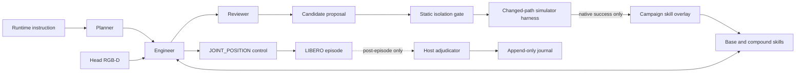

<h1 align="center">RoboHermes LIBERO</h1>

<p align="center">
  <strong>Inspectable robot skills, GPT-driven composition, and simulator-gated self-evolution.</strong>
</p>

<p align="center">
  
  <a href="LICENSE"></a>
  
  
  
</p>

RoboHermes is a skill-first embodied agent for LIBERO. A Planner produces a
visible plan, an Engineer composes camera-grounded skills, and an independent
Reviewer diagnoses the visible trace. Candidate skill changes run in an
isolated overlay and are promoted only after a native simulator-success
harness verdict.

## Evidence Tracks

| Metric | Result | Scope |
|---|---:|---|
| **LIBERO-Plus adaptive Pass@2** | **398/840 (47.4%)** | 840 stratified identities; fixed 261/840; +16.3 pp across evolving releases |
| **Adaptive task-level Pass@10** | **95/120 (79.2%)** | Cross-release adaptive development coverage |
| Sequential adaptive campaign | 32/120 -> 83/120 | Ten evolving-release rounds; 2.342B tokens, 11.09 active hours |
| Strict Standard-130 Pass@10 | 67/130 (51.5%) | No Agent-visible checker, latch, hidden pose, or policy checkpoint |
| Matched Code-on/off | 174/600 vs 129/600 | Five seeds; +7.5 pp; McNemar `p=8.06e-5` |
| Matched median tokens | 2.58M vs 3.65M | Separate 118-task Code-on/off efficiency panel |
| ACT corrective transport | 1/1 native success | One matched seed-3 case; not held-out generalization |

The adaptive breakdown is Spatial `9/10`, Object `10/10`, Goal `9/10`, and
LIBERO-90 `67/90`. This headline is cumulative coverage across evolving
releases. It is **not** a frozen-policy result, a single-release result, or
conventional fixed-method Pass@10. LIBERO-Plus, strict, adaptive,
matched-ablation, and ACT results stay separate in the data and UI.

The final LIBERO-Plus panel covers seven perturbation categories and three
short suites. Fixed single-attempt succeeds on `261/840`; adaptive Pass@2
reaches `398/840`, adding 137 identities (`+16.3` percentage points). The
adaptive stages consume `1.474B` metered tokens and `16.35h` active wall time.
This is adaptive development coverage, not a fixed-policy score or a direct
RoboHarness/OpenETA leaderboard comparison.

```bash
./robohermes results replay \
  --manifest evidence/adaptive-pass10-v1/manifest.json
```

The compact public bundle contains one canonical native-success row for each
solved task. It exactly replays the task-level score against the fixed 120-task
catalog. Its token/time totals cover those success evidence rows only, not all
failed or infrastructure attempts.

<p align="center">
  
</p>

<p align="center"><a href="https://robo-rsi.com/"><strong>Open the live project page and rollout evidence</strong></a></p>

## Videos And Publication Data

The project page includes ten decoded native-success videos: four exact
Standard-130 episodes, one sequential-adaptive episode, the ACT matched case,
and four LIBERO-Plus perturbation successes. Every video opens with its task,
seed, evidence scope, and ordered tool name/outcome chain. The hero contains
only LIBERO simulator successes.

Publication values are machine-readable in
[`evidence/publication-v1/experiments.json`](evidence/publication-v1/experiments.json).
The final Plus object is
[`evidence/publication-v1/libero_plus_final.json`](evidence/publication-v1/libero_plus_final.json).
The dashboard packages both sources without maintaining a second statistics
path.

- [Experiment inventory and RoboHarness/OpenETA comparison](docs/EXPERIMENTS_AND_COMPARISON.md)
- [Chinese media draft](PRESS_KIT_ZH.md)
- [Chinese and English X copy, captions, and alt text](SOCIAL_COPY.md)

The comparison is protocol-aware rather than a shared leaderboard. OpenETA's
reported `117/130 Pass@5`, for example, uses 512x512 multi-view feedback, a
5000-step horizon, up to 5400 seconds, and an Agent-callable native task
checker with a terminal success latch. RoboHermes strict prohibits checker and
latch visibility.

## Architecture



The Planner, Engineer, Reviewer, skills, and prompts never receive simulator
predicate source, reward, object poses, or a completion latch. The host calls
the final predicate once the visible tool loop has ended.

## Quick Start

### Replay the reported result (CPU, no API)

```bash
git clone https://github.com/nssmd/RoboHermes-LIBERO.git
cd RoboHermes-LIBERO
./setup.sh --core-only
./robohermes results replay \
  --manifest evidence/adaptive-pass10-v1/manifest.json
./robohermes dashboard --no-browser
```

### Run a new simulator campaign

Prerequisites: Linux, Git, Python 3.10-3.12, a working NVIDIA/CUDA stack, and
an OpenAI-compatible Responses endpoint serving `gpt-5.6-sol`.

```bash
export OPENAI_API_KEY="..."
./setup.sh
./robohermes doctor
./robohermes eval libero-short --mode adaptive
```

`setup.sh` creates isolated environments, installs this package and the pinned
LIBERO checkout, installs the pinned PyRoKi solver, writes `robohermes.yaml`,
starts the motion service, and runs diagnostics. It is idempotent.

The first perception run downloads Grounding-DINO and SAM model weights. The
default open-source path uses a deterministic point-cloud top-down fallback for
grasp candidates. The reported historical releases also used an optional
GraspGen server; see [REPRODUCING.md](REPRODUCING.md) before comparing a fresh
campaign with the retained score.

## Commands

| Command | Purpose |
|---|---|
| `./robohermes configure` | Write the single YAML configuration; never stores a key |
| `./robohermes doctor` | Validate provider, LIBERO, output path, and services |
| `./robohermes services start` | Start and warm the isolated PyRoKi service |
| `./robohermes eval libero-short --mode adaptive` | Ten ordered seeds with harness-gated skill overlays |
| `./robohermes eval libero-short --mode fixed` | One immutable release with evolution disabled |
| `./robohermes results replay --manifest ...` | Recompute task-level coverage from retained verdicts |
| `./robohermes dashboard` | Open the local desktop evaluation console |

## Configuration

All machine-specific values live in `robohermes.yaml`:

```yaml
provider:
  model: responses/gpt-5.6-sol
  reasoning_effort: medium
  base_url: https://api.openai.com/v1
  api_key_env: OPENAI_API_KEY
evaluation:
  mode: adaptive
  seeds: [0, 1, 2, 3, 4, 5, 6, 7, 8, 9]
  task_count: 120
  tool_budget: 120
integrity:
  success_source: posthoc_simulator_predicate
  expose_task_checker: false
  action_success_latch: false
  allow_hidden_object_state: false
```

The API key itself stays in the named environment variable. A run snapshots
the resolved non-secret config, catalog, release identity, seed schedule, and
artifact roots before workers start.

## Run Artifacts

```text
runs/<run-id>/
  manifest.json              immutable protocol and release metadata
  config.resolved.yaml       non-secret resolved configuration
  state.json                 atomic resume and success-protection state
  result.json                task-level score and efficiency summary
  journals/                  append-only episode verdicts
  episodes/                  plans, traces, images, and role artifacts
  media/                     success, failure, and infrastructure videos
  trajectories/              frame-level Parquet trajectories
  proposals/                 every proposed change and gate decision
  candidate_overlays/        rejected and accepted candidate code
  releases/                  immutable promoted overlay snapshots
```

Successful task/seed pairs are never rerun. Provider, transport, image,
resource, and interrupted records are retained and retried without entering the
task denominator. Failed proposals and failed simulator episodes are never
deleted.

## Integrity Tests

The test suite checks:

- the exact 120-task catalog and ordered seed protocol;
- final-predicate-only success and infrastructure exclusion;
- no Agent-visible task checker or hidden object-state access;
- successful task/seed resume protection and immutable manifests;
- static proposal leak checks plus native-success promotion;
- exact replay of `95/120` and all four suite totals;
- secret/private-path release hygiene and dashboard data parity.

```bash
python -m pytest -q
python scripts/release_check.py
```

## Scope And Dependencies

This repository intentionally contains only the LIBERO short runtime and its
transitive dependencies. It does not contain unrelated benchmark pipelines,
private endpoints, credentials, historical raw logs, or machine-specific
launchers.

RoboHermes is Apache-2.0. LIBERO and PyRoKi retain their upstream licenses.
GraspGen is an optional external dependency with NVIDIA's non-commercial use
restriction; it is not vendored or installed by default.

## Citation

```bibtex
@software{robohermes_libero_2026,
  title  = {RoboHermes LIBERO: Skill-First Adaptive Robot Evaluation},
  author = {RoboHermes Contributors},
  year   = {2026},
  url    = {https://github.com/nssmd/RoboHermes-LIBERO}
}
```

See [REPRODUCING.md](REPRODUCING.md) for protocol details and
[CONTRIBUTING.md](CONTRIBUTING.md) before changing a visible skill or evaluator.
